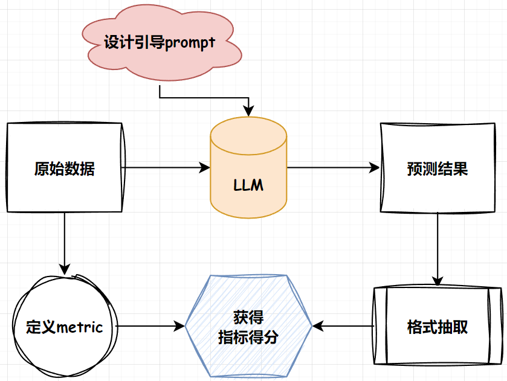

# This is tiny_compass

## 😃Why tiny-compass? 
初入`LLM`大门，你是否有类似的困惑:

1. 模型五花八门，垂域任务也五花八门。除了`human_eval`之外，如何对个性化的任务提供有说服力的定量性能指标?  
2. 各个模型的评测指标五花八门?小白初学者看不懂,难以学习?
3. 评测`metric`不会选,除了`rouge`,`blue`想不到其他的`metric`?
4. 想让`LLM`做选择题,但是模型输出了一大堆,如何评价选择能力?

如果有，那么:   
<span style="font-size: 24px;">**_tiny-compass is all you need!_**</span>


## 🙋What is compass?
首先要明确评测任务的基础pipeline。下图是评测任务的简要流程： 

  

- 首先，根据目标数据集的任务类型指定合理的评测`metric`.
- 根据目标数据的形式总结模型引导`prompt`.
- 根据模型初步预测结果采纳合理的抽取方式.
- 对相应的`pred`与`anwser`进行得分计算.

## 😋Support datasets&metrics.
所采用的数据集在这里[here](./dataset/),目前有的数据集与类型包含(后续会持续更新!): 

|name|type|metric|
|---|---|---|
|multi_news|长文本问答|Rouge|
|multifieldqa_zh|短文本问答|f1|
|trec|生成式选则|accuracy|

## 💁Metrics explanation.
看到了上面的指标是否有这样的疑问:  
- What? `F1` 不是分类指标，怎么跑`llm`去了?
- `accuracy`不是要分`label`标签的吗?怎么跑生成式里来了?  

Okey,这一节主要就是讲解上述的疑问,如果有基础的同学，可以先自行探索[相关代码](./metrics.py)  

### 1. 生成式的f1

#### 1.1 模型推理
- 首先,对于一个评测数据集,我们首先要构造引导prompt,即引导llm生成我们想要的答案。对于已有的数据集,大部分都提供了相应的prompt,在自己数据集评测时,也可自行设计。以`multifieldqa_zh`为例,其引导prompt为:
```
阅读以下文字并用中文简短回答：\n\n{context}\n\n现在请基于上面的文章回答下面的问题，只告诉我答案，不要输出任何其他字词。\n\n问题：{input}\n回答：
```
- 之后,再指定模型的输入长度,在此主要是规定每次送进模型多少token数,一般为了追求性能可以设置为模型最大长度,可以在下载好的模型文件里面的`config.json`里面的"max_position_embeddings"查询,也可以不设置作为默认最大长度.但本项目设置为了2048,主要为了演示使用~  

- 之后就是创建model整体,在此我对模型整体创建了一个class,大家可以参考对其他任意的model进行组装:
```python
class BaseLLM:
    def __init__(self, path: str, model_name: str) -> None:
        self.path = path
        self.model_name = model_name

    def build_chat(self, tokenizer: str, prompt: str, model_name: str):
        pass

    def load_model_and_tokenizer(self, path: str, model_name: str, device):
        pass

    def post_process(self, response: str, model_name: str):
        pass

    def get_pred(self, data: list, max_length: int, max_gen: int, prompt_format: str, device, out_path: str):
        pass
```
- 参数解读,build_chat为使用模型固有的数据加载形式,以`internlm2`为例,其为
```python
def build_chat(self, prompt):
        prompt = f'<|im_start|>user\n{prompt}<|im_end|>\n<|im_start|>assistant\n'
        return prompt
```
- model与tokenizer不用多说,后处理根据model的形式选择性判断是否需要，重点讲一下`get_pred`函数：

```python
def get_pred(self, data, max_length, max_gen, prompt_format, device, out_path):
        model, tokenizer = self.load_model_and_tokenizer(self.path, device)
        for json_obj in tqdm(data):
            prompt = prompt_format.format(**json_obj)
            # 在中间截断,因为两头有关键信息.
            tokenized_prompt = tokenizer(prompt, truncation=False, return_tensors="pt").input_ids[0]
            if len(tokenized_prompt) > max_length:
                half = int(max_length/2)
                prompt = tokenizer.decode(tokenized_prompt[:half], skip_special_tokens=True)+tokenizer.decode(tokenized_prompt[-half:], skip_special_tokens=True)

            prompt = self.build_chat(prompt)

            input = tokenizer(prompt, truncation=False, return_tensors="pt").to(device)
            # 表示喂进去的tokens的长度
            context_length = input.input_ids.shape[-1]
            eos_token_id = [tokenizer.eos_token_id, tokenizer.convert_tokens_to_ids(["<|im_end|>"])[0]]

            output = model.generate(
                **input,
                max_new_tokens=max_gen,
                do_sample=False,
                temperature=1.0,
                eos_token_id=eos_token_id,
            )[0]
            
            pred = tokenizer.decode(output[context_length:], skip_special_tokens=True)
            pred = self.post_process(pred)
            
            with open(out_path, "a", encoding="utf-8") as f:
                json.dump({"pred": pred, "answers": json_obj["answers"], "all_classes": json_obj["all_classes"], "length": json_obj["length"]}, f, ensure_ascii=False)
                f.write('\n')
``` 

- 有的同学可能会问,为啥要整这么一大串,直接用`model.chat()`不香吗?? 
- Okey!这个函数就告诉了你答案。原因就在于截断策略,对于模型而言,尤其是制定了输入的长度,如果使用阶段命令则其会在输入的末尾进行阶段,但由于引导性`prompt`的存在,在`inputs`的两端均有关键信息,故需要对两端的信息进行保留,对中间部位进行截断操作,才能最大限度地抱持输出效果!

> tips: get_pred部分,可以参考各大模型各自的`model`相关脚本中的`chat`函数(`internlm2`在`modeling_internlm2.py`里面),也可以更好的理解原始文本输入与结构化模型输出。

#### 1.2 结果评测
直接show例子:
```
"pred": "57081.86元", "answers": "人民币57081.86元。"
```
- 首先,经过数据清洗与`jieba`分词,将短句分为词组,以示例文本为例,经过分词与去掉标点符号等操作,得到下列输出:
```
"pred": ['5708186', '元'], "answers": ['人民币', '5708186', '元']"
```
将上述的两个"干净"的输出送入`f1`评分函数如下:
```python
def f1_score(prediction, ground_truth, **kwargs):
    # Counter以dict的形式存储各个句子对应的词与其对应个数,&操作符返回两个Counter中共同的元素的键值对
    common = Counter(prediction) & Counter(ground_truth)
    # 显示prediction与gt的共同元素的个数  
    num_same = sum(common.values())                       
    if num_same == 0:
        return 0
    # 即模型预测正确的样本数量与总预测样本数量的比值
    precision = 1.0 * num_same / len(prediction)
    # 模型正确预测的样本数量与总实际样本数量的比值         
    recall = 1.0 * num_same / len(ground_truth)           
    f1 = (2 * precision * recall) / (precision + recall)
    return f1
```
- 首先记录两个list中相同的元素,再统计相同的元素的总数,最终再按照precision与recall的定义分别计算相应的分数。  
- 然后就得到该结果的对应分数啦,最后再将所有的结果取平均值,即得到该`task`的`f1_score`

### 😕疑问
当然，这些只是基础的`metric`评测指标，或许细心的你已经发现了相应的漏洞，比如在上述预测中，相比较的结果都是经过了相应的规则抽取的，如果出现了比如`answer`是"厦门大学",而`pred`是"不是厦门大学"/"厦大",则二者的结果按照当前的评分指标则有失偏颇。
    
当然,更加准确的评测metric也是学术界一直努力的目标,本项目也会及时跟进更加先进的评测策略,也欢迎大佬PR！！

## 😆Get start!

### 1. get inference results
```python
python inference.py
```

### 2. get eval results
```python
python eval.py
```

## support metrics
1. f1 score
2. rouge-series/blue-series
3. accuracy

## Reference & Acknowledgment
[LongBench: A Bilingual, Multitask Benchmark for Long Context Understanding](https://arxiv.org/abs/2308.14508)
