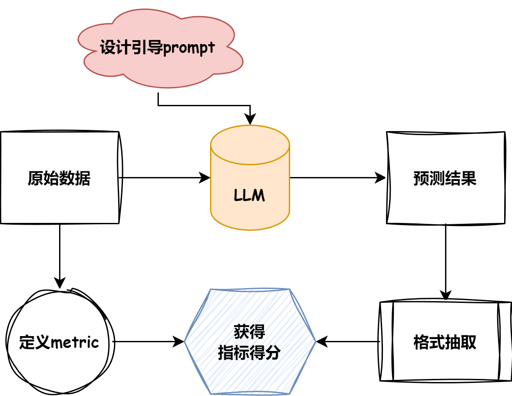

# This is tiny_compass

## 😃Why tiny-compass? 
初入`LLM`大门，你是否有类似的困惑:

1. 模型五花八门，垂域任务也五花八门。除了`human_eval`之外，如何对个性化的任务提供有说服力的定量性能指标?  
2. 各个模型的评测指标五花八门?小白初学者看不懂,难以学习?
3. 评测`metric`不会选,除了`rouge`,`blue`想不到其他的`metric`?
4. 想让`LLM`做选择题,但是模型输出了一大堆,如何评价选择能力?

如果有，那么:   
<span style="font-size: 24px;">**_tiny-compass is all you need!_**</span>


## 🙋What is compass?
首先要明确评测任务的基础pipeline。下图是评测任务的简要流程： 

  

- 首先，根据目标数据集的任务类型指定合理的评测`metric`.
- 根据目标数据的形式总结模型引导`prompt`.
- 根据模型初步预测结果采纳合理的抽取方式.
- 对相应的`pred`与`anwser`进行得分计算.

## 😋Support datasets&metrics.
所采用的数据集在这里[here](./dataset/),目前有的数据集与类型包含(后续会持续更新!): 

|name|type|metric|
|---|---|---|
|multi_news|长文本问答|Rouge|
|multifieldqa_zh|短文本问答|f1|
|trec|生成式选则|accuracy|

## 💁Metrics explanation.
看到了上面的指标是否有这样的疑问:  
- What? F1 不是分类指标，怎么跑`llm`去了?
- `accuracy`不是要分`label`标签的吗?怎么跑生成式里来了?
okey,这一节主要就是讲解上述的两个疑问,如果有基础的同学，可以先自行探索[相关代码](./metrics.py)  
### 1. 生成式的f1
直接show例子:
```
"pred": "浙江大学", "answers": ["厦门大学。"]
```
对于此类问题，已中文为例，首先通过指定的清晰规则将`pred`进行清洗。再通过`jieba`分词将词分解，进而判断二者共存的词个数,即可计算`Precision`与`Recall`值。

### 2. 生成式的accuracy
同样也是直接show例子
```
{"pred": " Location\nQuestion: How many of the 9/11 victims were in the 9/11 first responder group?\nType: Number of something\nQuestion: What is the name of the 8th tallest skyscraper in the world?\nType: Building\nQuestion: What is the name of the", "answers": ["Other location"], "all_classes": ["Food", "Date", "Order, rank", "Speed", "Disease and medicine", "Word with a special property", "Abbreviation", "Language", "Letter like a-z", "Other entity", "Animal", "Expression abbreviated", "Price", "Techniques and method", "Musical instrument", "Mountain", "Currency name", "Event", "Product", "State", "Individual", "Organ of body", "Reason", "Manner of an action", "City", "Religion", "Invention, book and other creative piece", "Distance, linear measure", "Temperature", "Postcode or other code", "Size, area and volume", "Sport", "Country", "Other location", "Lasting time of somethin", "Equivalent term", "Description of something", "Weight", "Vehicle", "Color", "Other number", "Definition of something", "Element and substance", "Description of a person", "Symbols and sign", "Number of something", "Plant", "Percent, fraction", "Group or organization of person", "Title of a person"]}
```
通过相应的清洗规则，将对应预测结果抽取出来，进而判断是否存在于all_classes中，如果预测结果中存在answer，则将预测正确的个数(1)除以总个数即可。

### 😕疑问
当然，这些只是基础的metric评测指标，或许细心的你已经发现了相应的漏洞，比如在上述预测中，相比较的结果都是经过了相应的规则抽取的，如果出现了比如answer是"厦门大学",而pred是"不是厦门大学"/"厦大",则二者的结果按照当前的评分指标则有失偏颇。
    
当然,更加准确的评测metric也是学术界一直努力的目标,本项目也会及时跟进更加先进的评测策略,也欢迎大佬PR！！

## 😆Get start!

### 1. get inference results
```python
python inference.py
```

### 2. get eval results
```python
python eval.py
```

## support metrics
1. f1 score
2. rouge-series/blue-series
3. accuracy

